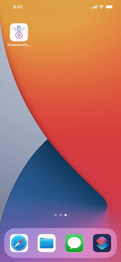

  <h1>Temperature Submission feat. Siri</h1>
  

    An app allowing for <strong>semi-automated temperature submissions</strong> via <strong>Siri voice commands</strong>
  

  

---

Too lazy to press tons of buttons in order to submit your temperature to multiple places?

Fret not! Now, you can simply tell Siri your body temperature, and Siri will help submit it for you.

Designed for lazy NUS High students also living in boarding, submitting temperatures to both school and boarding daily.

## Configuration

It's relatively straightforward:

- Compile and install the app on your iPhone, making sure to switch to your own developer account for app signing.
- Run the app.
- Allow notifications.
- Read and agree to the Terms of Use.
- Sign in to your school Microsoft account within the app.
- Tap 'Add to Siri' within the app, and confirm to do so.
- You're ready to use it!

The school temperature submission only occurs under specific criteria that the app detects, as the form itself has no special handling of allowed submission times. Please modify the code accordingly depending on what're the dates you need to submit.

If you are not a boarder or not a NUSH student, you should not use the app without any configuration on your part, as the app can automatically submit your temperature for both NUS High Boarding School and NUS High School forms.

## Usage

User: "Hey Siri, submit temperature!"

Siri: "What's your body temperature?"

User: "36.9"

Siri: \*submits temperature using the app\*

...

Profit!

\* Note: Siri won't submit any temperature readings above 37.5 or below 35.9, both inclusive, to reduce chances of errors.

## Features

- Simplify more than 10 button presses into a single voice command.
- You aren't faking your temperature as part of the automation (as you must tell Siri your real reading).
- Works in the background after initial launch, so don't worry if you exit the app midway. Even if otherwise, a notification will let you know temperature submission has failed.
- Works with Siri Shortcuts: Combine other automations with this app (such as SG TraceTogether's Siri Shortcuts for SafeEntry), or even use a scheduled time-based Shortcuts automation to trigger it.

## Terms of Use

By using the app's automation, form submissions, and Siri commands as is without modifications, you agree that, at the time of use:

- You are a NUSH Boarder **and** also a NUSH Student, and are actively staying in boarding.
- You provided your real temperature reading to Siri.
- You are not sick, and do not have cough or runny nose symptoms.
- You have done SafeEntry in the morning or as part of an automation together with the app's.

You also agree that:

- While the app is designed to be rule-abiding and legal, the developer will not liable against any misconduct in conjunction with the app, especially due to code modifications or disagreeing with the Terms of Use.

These terms will also be flashed on screen on initial launch of the app.
